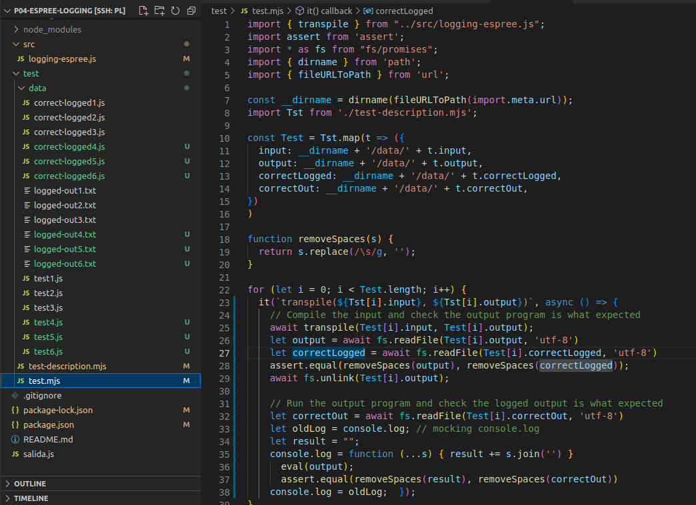
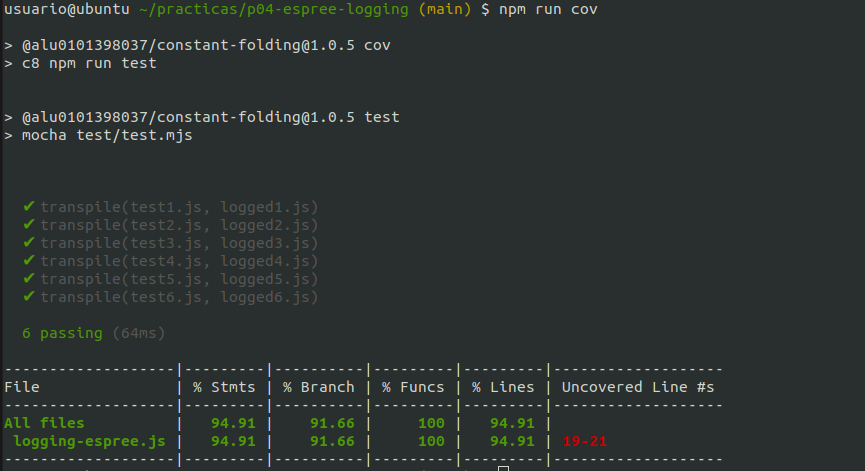
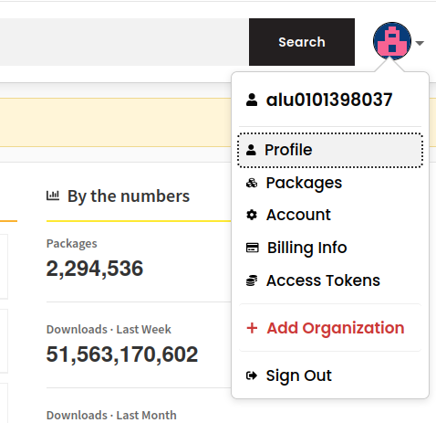
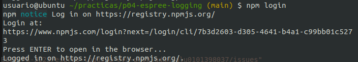
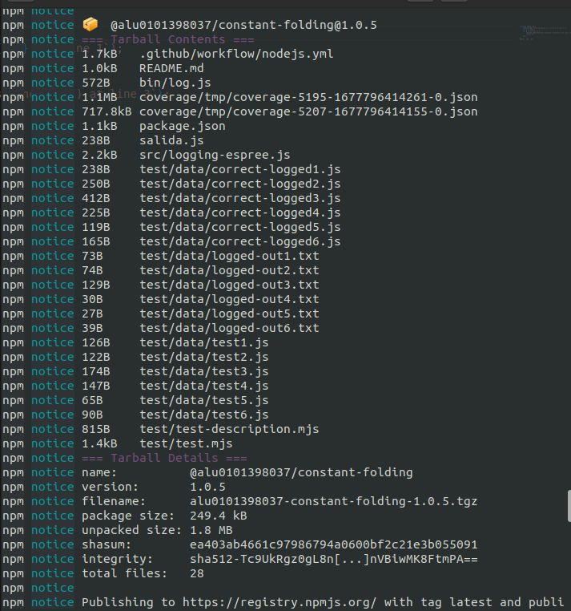
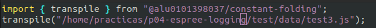
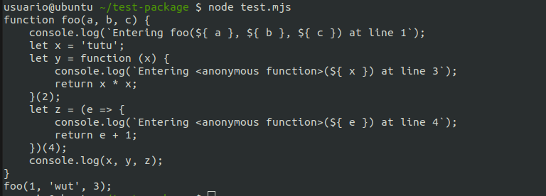

[](https://classroom.github.com/open-in-codespaces?assignment_repo_id=10350773)
# Práctica Espree logging

## Guía de uso

Para instalar el paquete, debe ejecutar el siguiente comando:

```
npm install @alu0101398037/constant-folding
```

Para ejecutar el programa, debe ejecutar el siguiente comando:

```
npx funlog <fichero de input>
```

## Resumen de lo aprendido

En esta práctica hemos aprendido a crear una función capaz de leer un archivo conteniendo una función y volcar su contenido correctamente, añadiendo información sobre la línea en la que se empezó a ejecutar la función, así como de los argumentos pasados.

Además, hemos aprendido a publicar un paquete con npmjs y a instalarlo.

## Indicar los valores de los argumentos

Se ha modificado el código de `logging-espree.js` para que el log también indique los valores de los argumentos que se pasaron a la función, así como la línea. 
Ejemplo:

```
/**
 * @brief Añade información mediante logs a las funciones.
 * Incluye el número de línea y los argumentos pasados.
 * @param node El nodo que se está visitando  (una función en este caso)
 */
function addBeforeCode(node) {
  const name = node.id ? node.id.name: '<anonymous function>';
  let paramNames = "";
  if (node.params.length) {
    paramNames = "${" + node.params.map(param => param.name).join("}, ${") + "}";
  }
  const lineN = node.loc.start.line;
  const beforeCode = "console.log(`Entering " + name + "(" + paramNames + ") at line " + lineN + "`);";
  const beforeNodes = espree.parse(beforeCode, { ecmaVersion: 12 }).body;
  node.body.body = beforeNodes.concat(node.body.body);  
}
```

## CLI con [Commander.js](https://www.npmjs.com/package/commander)

En nuestro archivo `bin/log.js`, tenemos el siguiente código:

```
#!/usr/bin/env node

import { program } from "commander";
import { createRequire } from "module";
const require = createRequire(import.meta.url);
const { version } = require("../package.json");
import { transpile } from "../src/logging-espree.js";

program
  .version(version)
  .argument("<filename>", 'file with the original code')
  .option("-o, --output <filename>", "file in which to write the output")
  .action((filename, options) => {
    transpile(filename, options.output);
  });

program.parse(process.argv);
```

Primero, importamos las liberías y archivos necesarios para la ejecución. Luego, especificamos las opciones que queremos que se apliquen (en este caso, -h para mostrar la ayuda, -o para especificar el nombre del fichero de output y -V para mostrar la versión).

## Reto 1: Soportar funciones flecha

En la función `addLogging` en el fichero `src/logging-espree.js`, ponemos lo siguiente:

```
/**
 * @brief Añade logs a nodos que sean una función, ya sea de declaration,
 * como de expression o como de arrow expression.
 * @param code
 */
export function addLogging(code) {
  const ast = espree.parse(code, { ecmaVersion: 12, loc: true });
  estraverse.traverse(ast, {
    enter: function(node, parent) {
      if (node.type === 'FunctionDeclaration' ||
          node.type === 'FunctionExpression' ||
          node.type === 'ArrowFunctionExpression') {
          addBeforeCode(node);
      }
    }
  })
  return escodegen.generate(ast);
}
```

Gracias a la línea `node.type === 'ArrowFunctionExpression'`, el programa es capaz de soportar las funciones flecha. Con las dos líneas de arriba, también es capaz de soportar las de declaración y expresión.

## Reto 2: Añadir el número de línea

Esto se consigue gracias a la siguiente línea de la función anterior:

```
const ast = espree.parse(code, { ecmaVersion: 12, loc: true });
```

Dicha línea, concretamente el `loc: true`, permite indicar el número de línea de la sentencia.

## Tests and Covering

Como se puede ver, tenemos 6 tests:



Estos tests se pasan correctamente con un buen cubrimiento:



## Github Actions

Para que las Github actions funcionen correctamente, creamos el siguiente fichero (`.github/workflows/nodejs.yml`):

```
# Write your workflow for CI here
name: CI

# Controls when the workflow will run
on:
  # Triggers the workflow on push or pull request events but only for the $default-branch branch
  push:
    branches: [ main ]
  pull_request:
    branches: [ main ]

  # Allows you to run this workflow manually from the Actions tab
  workflow_dispatch:

jobs:
  build:

    runs-on: ubuntu-latest

    strategy:
      matrix:
        node-version: [14.x, 16.x, 18.x]
        # See supported Node.js release schedule at https://nodejs.org/en/about/releases/

    steps:
    - uses: actions/checkout@v3
    - name: Use Node.js ${{ matrix.node-version }}
      uses: actions/setup-node@v3
      with:
        node-version: ${{ matrix.node-version }}
        cache: 'npm'
    - run: npm ci
    - run: npm run build --if-present
    - run: npm test
```

## `package.json`

```
{
  "name": "@alu0101398037/constant-folding",
  "author": "Eva Peso Adán <alu0101398037@gmail.com>",
  "description": "Adds logs to javascript code",
  "entry point": "src/logging-espree.js",
  "type": "module",
  "bin": {
    "funlog": "bin/log.js"
  },
  "scripts": {
    "test": "mocha test/test.mjs",
    "cov": "c8 npm run test"
  },
  "dependencies": {
    "acorn": "^8.8.2",
    "commander": "^10.0.0",
    "escodegen": "^2.0.0",
    "espree": "^9.4.1",
    "estraverse": "^5.2.0",
    "underscore": "^1.12.0"
  },
  "version": "1.0.5",
  "devDependencies": {
    "c8": "^7.13.0",
    "mocha": "^10.2.0",
    "nyc": "^15.1.0"
  },
  "main": "src/logging-espree.js",
  "directories": {
    "test": "test"
  },
  "repository": {
    "type": "git",
    "url": "git+https://github.com/ULL-ESIT-PL-2223/espree-logging-eva-peso-adan-alu0101398037.git"
  },
  "keywords": [
    "espree"
  ],
  "license": "ISC",
  "bugs": {
    "url": "https://github.com/ULL-ESIT-PL-2223/espree-logging-eva-peso-adan-alu0101398037/issues"
  },
  "homepage": "https://github.com/ULL-ESIT-PL-2223/espree-logging-eva-peso-adan-alu0101398037#readme"
}
```

## Creando un paquete

Para ello, primero tenemos que crear una cuenta en `npmjs.com`:



Lo siguiente es ejecutar `npm login` y entrar con nuestra cuenta en el link proporcionado:



Luego, editamos el fichero `vi ~/.npmrc` y añadimos las siguientes líneas:

```
--init-author-name=alu0101398037
--init-author-email=alu0101398037@ull.edu.es
--init-author-url=https://github.com/epesoadan
@alu0101398037:registry=https://registry.npmjs.org/
```

Y luego realizamos `npm init --scope=@alu0101398037` para crear el paquete en el scope que queremos.

Lo último que queda entonces es realizar `npm publish --access=public` para publicar el paquete.


## Instalando un paquete

La manera de instalar el paquete ya se ha especificado en la sección "Guía de uso". Aquí mostraremos que se instala correctamente con esos pasos.



El comando instala el paquete correctamente.



Creamos un archivo llamado `test.mjs` para importar un fichero de test.



Vemos que se ejecuta de forma esperada.
